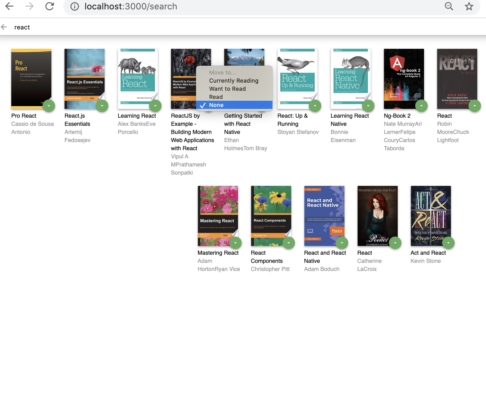

# Reactnd-project-myreads-starter
#React Project

This is a first project from a NanodegreeReact course in Udacity. 
MyReads App is a sigle page app with two interface , one  is a library with 3 shelves ,that you can move books between them and the other one is for searching books and add them to the library.

## Used Concepts :
* sigle page app
* How to breake UI to components, DOT
* props
* state Management
* functional component
* using API to work with database
* using map & filter in JS
* Router
* controlled component 


### Installing

A step by step  how to get a development env running

```
$ git clone https://github.com/larijanim/reactnd-project-myreads-starter.git
$cd reactnd-project-myreads-starter
$ npm install
$ npm start
```


## Running the tests

Explain how to run the automated tests for this system

### components Structure

* APP.js
* List_books
  * Shalves
  * BooksGrid
  * Books
  * BooksShelfchnger.js
* Search_Books
  * Books
  * BooksShelfchnger.js


### Screenshot of APP




## Deployment

Add additional notes about how to deploy this on a live system

## Built With

* HTML 
* CSS
* JS 
* React


## Author

 *Initial work* - [Maryam Larijani](https://www.linkedin.com/in/maryam-larijani-7a575082/)


